# Final Project

This case study extends the CI/CD Pipeline Project with provisioning and monitoring components. 

In this project the steps that I followed are:
 
* Create a Jenkins(CI/CD) pipeline to deploy a Flask application onto a Kubernetes cluster created with Ansible.
* Install and configure monitoring on the Kubernetes clusters and Flask application.
* Use Prometheus/Grafana to monitor the cluster  
* Create a load with a tool like stress to simulate application activity. 

## Project Milestones

### Stage One: 

Project Desing

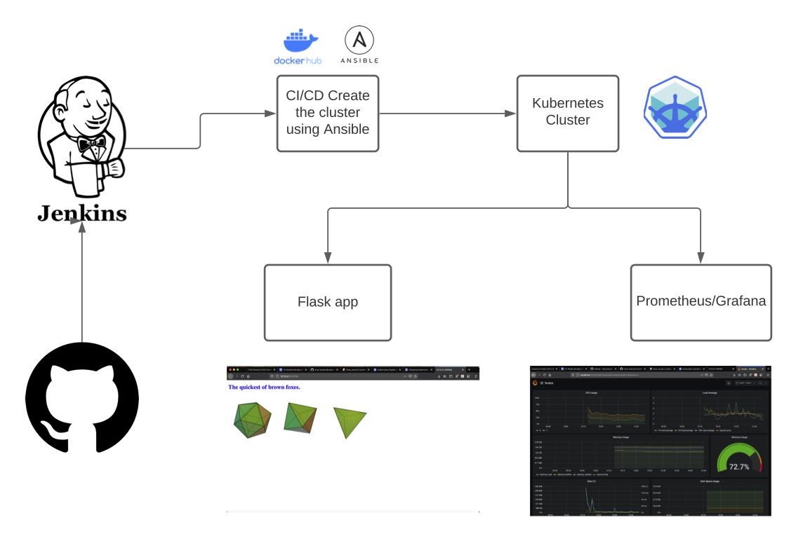

List of components in the architecture:

* GitHub
* Docker
* Jenkins
* Kubernetes (minikube)
* Prometheus/Grafana

### Stage Two:

Deployment

* Minikube will start the cluster locally

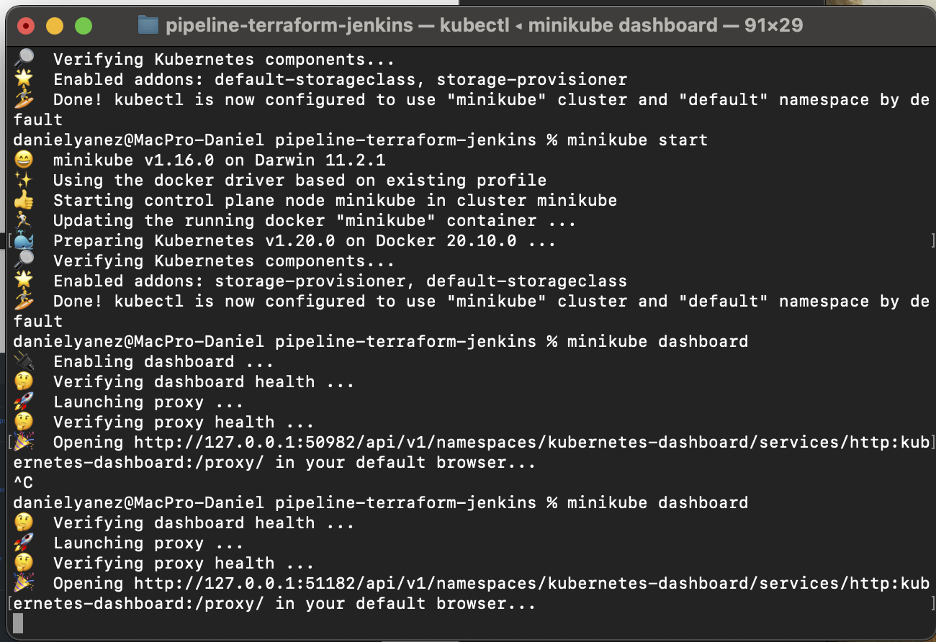

* Deploy the Flask application in the cluster using Ansible

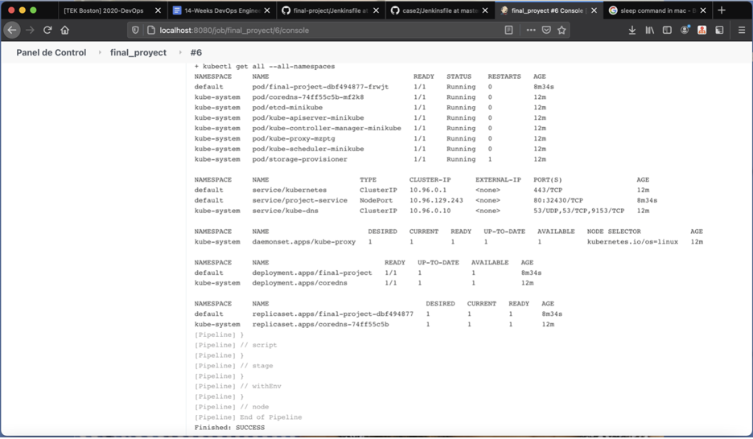

* Check if the app is running

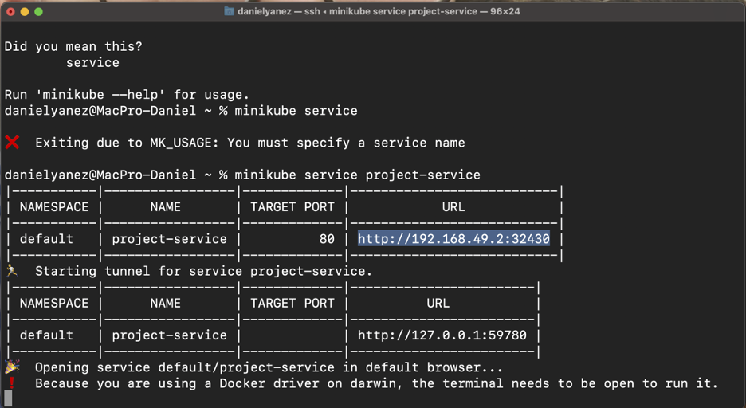

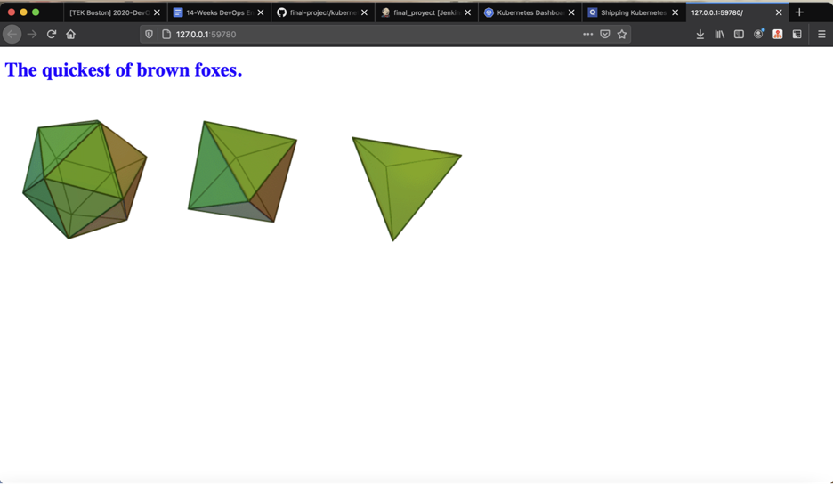

### Stage Three:

Monitoring

* Download Prometheus/Grafana using Helm

* Installing Prometheus/Grafana with Helm will automatically set it up

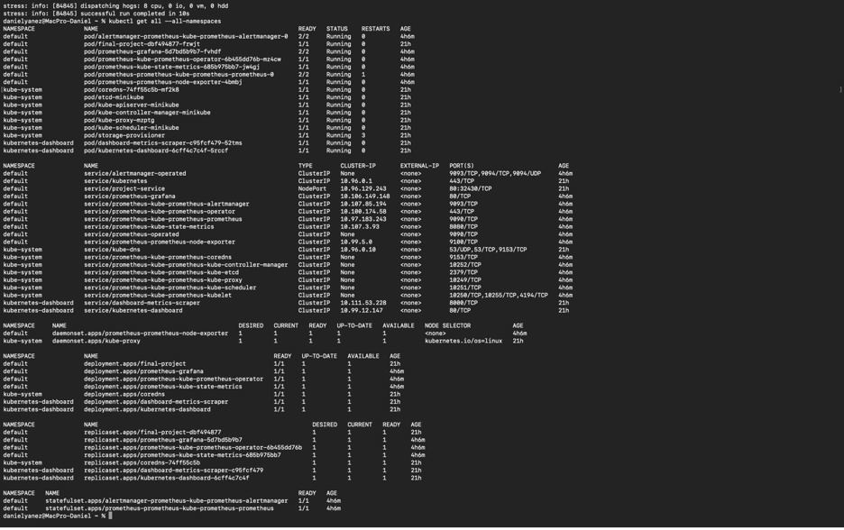

* Port-forward the grafana pod to show the Dashboard on the browser in port 3000

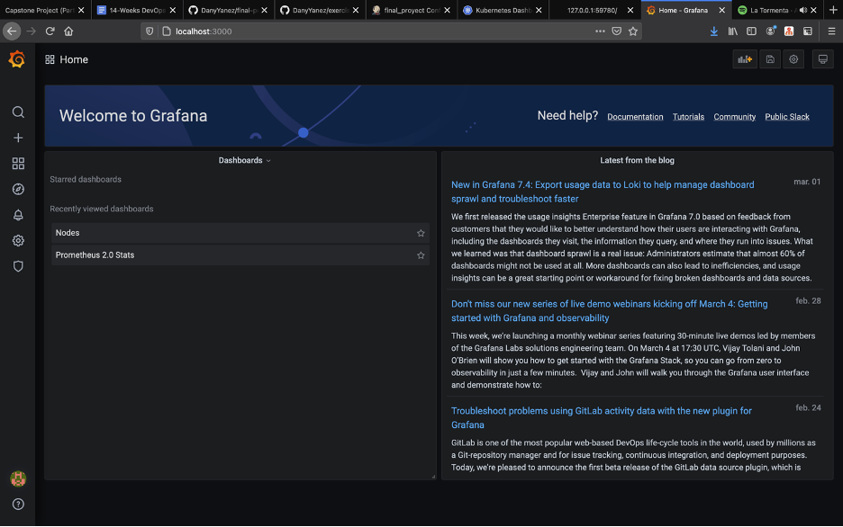

* Get the minikube cluster information

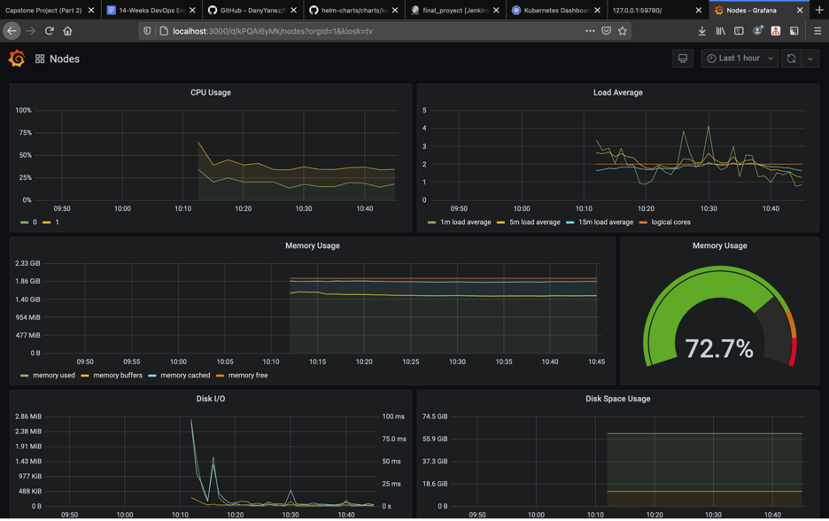

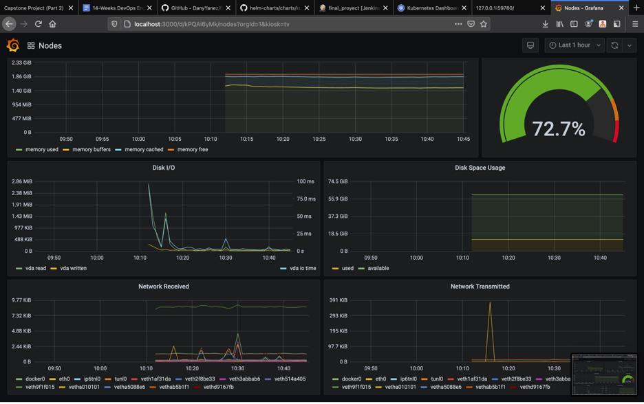

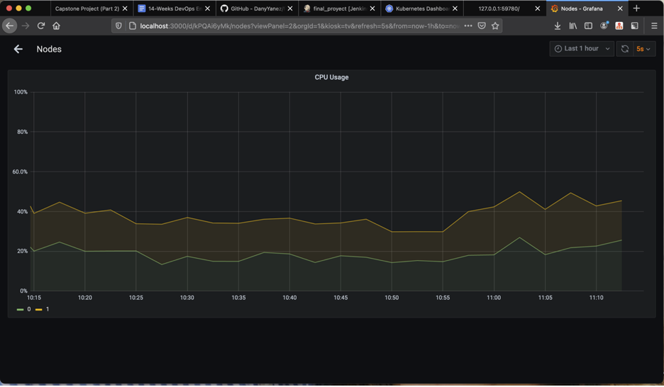

* Get the information of the application pod

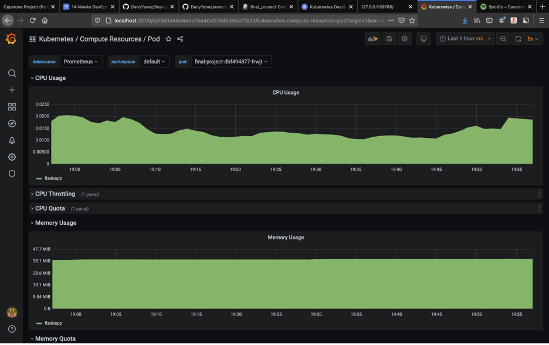

* Stress the port where the applications is and see the difference

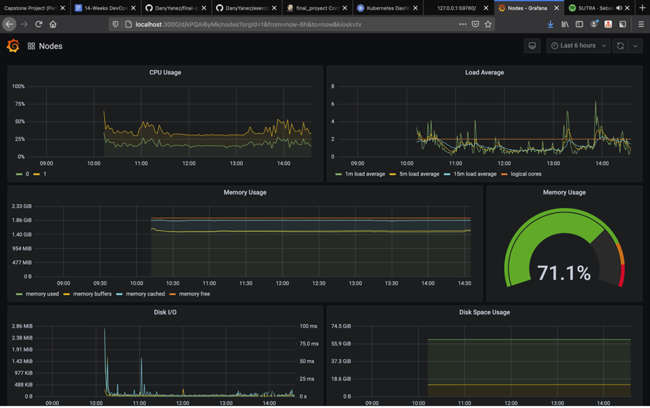

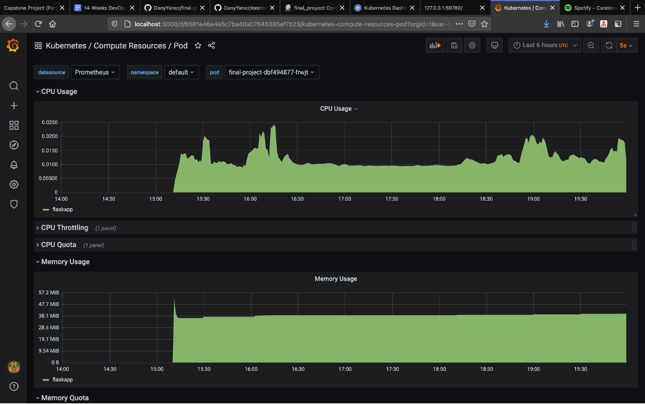

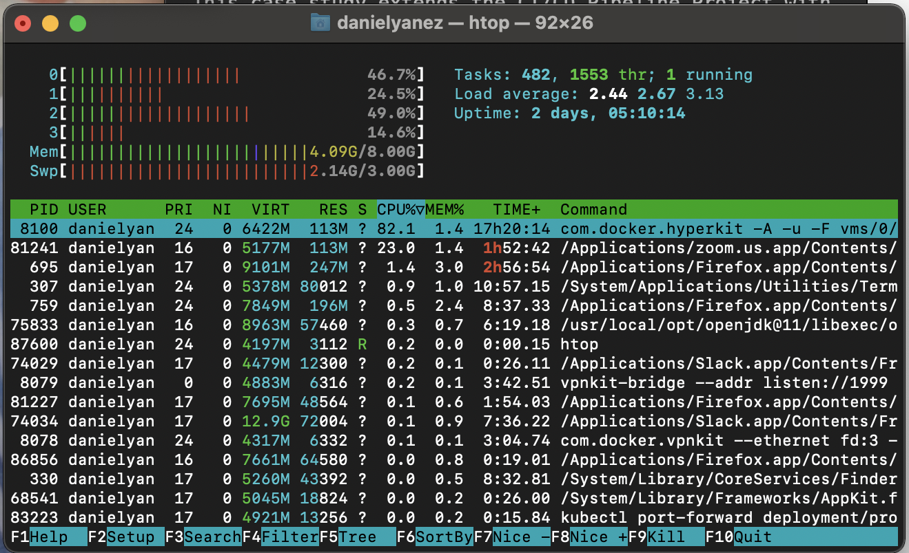

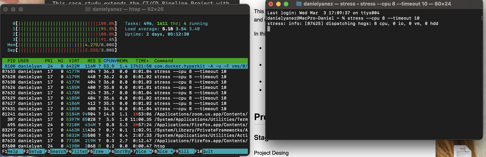
